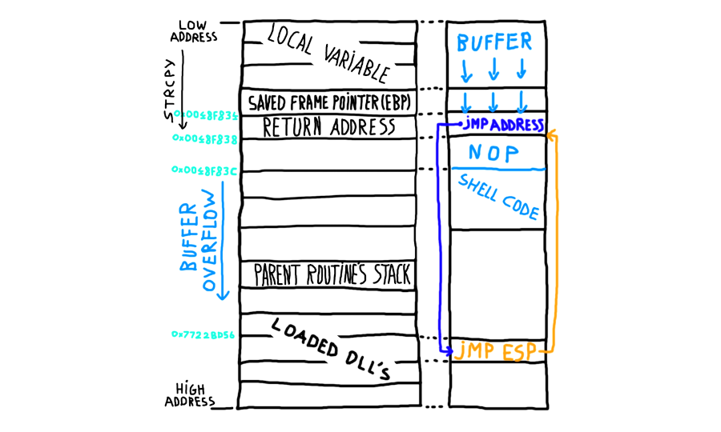

# Introduction

## What?

Being able to generate stack-based payloads for a vulnerable binary using Immunity Debugger.

|  |
|:--:|
| Credit: [Felix Weyne: Buffer Overflow explained](https://www.uperesia.com/buffer-overflow-explained) |

## Why?

Buffer overflows are used in many of the exploits against vulnerable services. Most of these are pre-compiled by 
exploit developers. To be able to generate payloads locally, set up a Kali VM and a Windows VM with Immunity Debugger
(on the same network).

## How?

* [Kali VM](kali.md)
* [Windows VM](windows.md)
* [Installing Immunity Debugger](immunity.md)
* [Using Immunity Debugger](overflow1.md)
* [Example payload script](overflow10.md)

