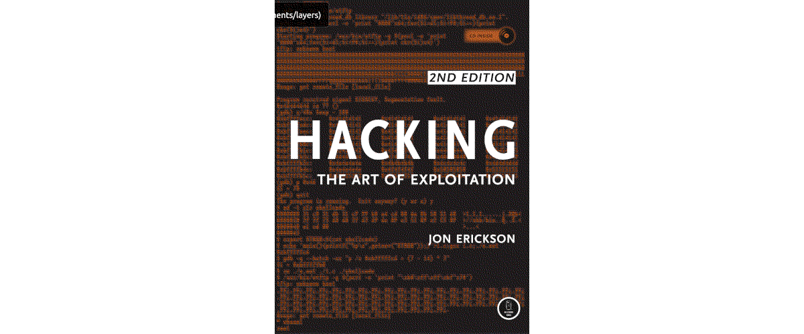

Woodpeckers
========================================================

Buffer overflows are used in many of the exploits that we use against vulnerable services. Most of these are
pre-compiled by exploit developers.

----

----

.. toctree::
   :maxdepth: 1
   :includehidden:
   :caption: Preparations

   docs/prep/README.md
   docs/prep/kali.md
   docs/prep/windows.md
   docs/prep/immunity.md
   docs/prep/overflow1.md
   docs/prep/overflow10.md

.. toctree::
   :maxdepth: 1
   :includehidden:
   :caption: Capture The Flag

   docs/ctf/README.md
   docs/ctf/brainstorm.md
   docs/ctf/gatekeeper.md

.. toctree::
   :caption: Links

   Red Team <https://red.tymyrddin.dev/>
