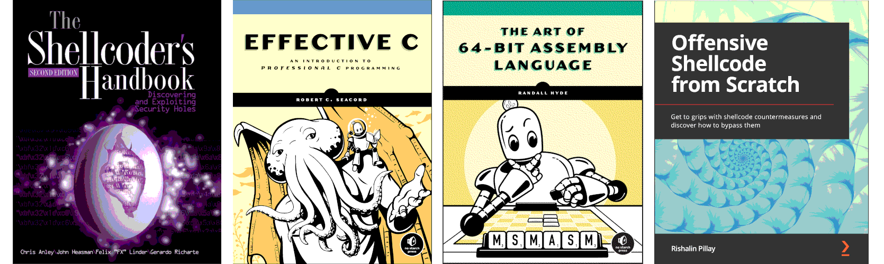

Woodpeckers
========================================================

Nearly all applications, web servers, and web application environments are vulnerable to buffer overflows. Environments that are written in interpreted languages, such as Java and Python, are immune to the attacks, with the exception of overflows in their interpreter. These issues are particularly problematic in the programming language C/C++ as it does not have buffer overflow protection built in.

Buffer overflows are used in many of the exploits against vulnerable services. Most of these are pre-compiled by exploit developers. To be able to generate payloads locally, set up a Kali VM with the necessary tools, and a Windows VM with Immunity Debugger (on the same network).

.. image:: _static/images/in-progress.png
  :alt: Forever in progress ...

----

.. toctree::
   :maxdepth: 1
   :includehidden:
   :caption: Testlab

   Virtual machines <https://red.tymyrddin.dev/projects/testlab/en/latest/docs/vm/README.html>
   Assemblers <https://red.tymyrddin.dev/projects/testlab/en/latest/docs/asm/README.html>
   Compilers <https://red.tymyrddin.dev/projects/testlab/en/latest/docs/com/README.html>
   Disassemblers <https://red.tymyrddin.dev/projects/testlab/en/latest/docs/dis/README.html>
   Debuggers <https://red.tymyrddin.dev/projects/testlab/en/latest/docs/deb/README.html>
   Decompilers <https://red.tymyrddin.dev/projects/testlab/en/latest/docs/dec/README.html>
   Exploit development <https://red.tymyrddin.dev/projects/testlab/en/latest/docs/edt/README.html>
   Exploitation tools <https://red.tymyrddin.dev/projects/testlab/en/latest/docs/exploitation/README.html>

----

.. toctree::
   :maxdepth: 1
   :includehidden:
   :caption: Notes on techniques

   docs/notes/README.md
   docs/notes/stack.md
   docs/notes/heap.md
   docs/notes/integer.md
   docs/notes/unicode.md
   docs/notes/string.md

.. toctree::
   :maxdepth: 1
   :includehidden:
   :caption: Windows overflows

   docs/windows/README.md

.. toctree::
   :maxdepth: 1
   :includehidden:
   :caption: Linux overflows

   docs/linux/README.md

----

.. toctree::
   :maxdepth: 1
   :includehidden:
   :caption: Coding

   Windows <https://github.com/tymyrddin/codes-bof/tree/main/windows>
   Linux <https://github.com/tymyrddin/codes-bof/tree/main/linux>

----

.. toctree::
   :maxdepth: 1
   :includehidden:
   :caption: TryHackMe

   docs/thm/README.md
   docs/thm/overflow1.md
   docs/thm/overflow10.md
   docs/thm/brainstorm.md
   docs/thm/gatekeeper.md

.. toctree::
   :glob:
   :maxdepth: 1
   :includehidden:
   :caption: Root-me

   docs/root-me/README.md
   docs/root-me/elf-86-stack-basic.md
   docs/root-me/elf-64-heap-basic1.md
   docs/root-me/elf-86-stack-basic2.md

----

